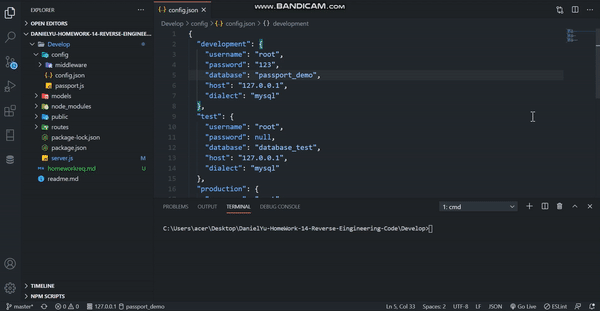
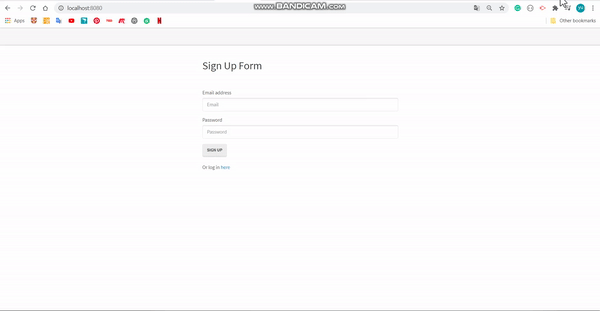

# Unit 14 Sequelize Homework: Reverse Engineering Code

# Project Explantation
```
1. A simple application to allow user to setup acount
2. MySQL as the database, Sequlize as Models, express.js as routes, and bcryptjs to keep user's password safety
```

## Install
```
1. Change the directory to Develop folder
2. Open TERMINAL
3. run `npm install` (`npm i`)
```


## Usage

* Run `node server.js`



* Sign up and Login



### Language
```md
Javascrpit
Express.js
Sequlize
MySQL
bcrypt.js
```